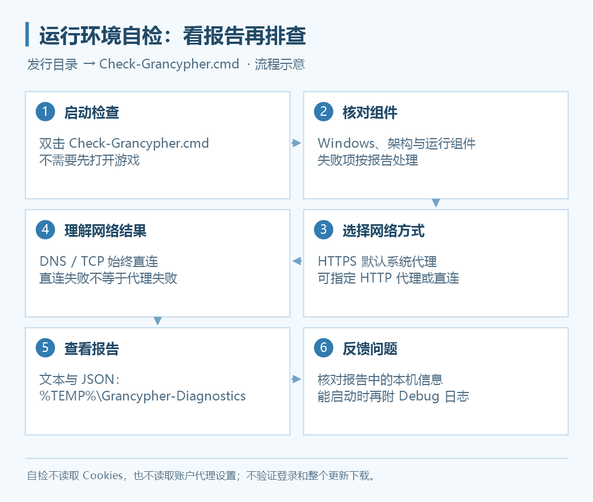

# 运行环境诊断

0.4.1 起，发行目录提供 **`Check-Grancypher.cmd`**。程序无法启动、提示缺少组件或网络不通时，可以先生成报告，不必进入游戏或提前安装开发工具。



## 一键检查

1. 打开安装目录或便携版解压目录。
2. 双击 `Check-Grancypher.cmd`。
3. 等待检查完成，按输出提示查看报告。

脚本兼容 Windows PowerShell 5.1，不需要管理员权限、.NET SDK 或 Visual Studio。默认报告保存在：

```text
%TEMP%\Grancypher-Diagnostics
```

报告包含中文文本与 JSON。运行库安装记录通过，只表示检查项满足，不保证程序在所有环境下一定能启动。

## 检查哪些项目

| 分类 | 内容 |
| --- | --- |
| 系统 | Windows 版本、架构 |
| 运行组件 | .NET Runtime、当前用户 Windows App SDK Runtime、VC++ 与 WebView2 |
| 本机网络 | 网卡、DNS 与 IP 信息 |
| 服务连通性 | 游戏主页、资源 CDN、GitHub 更新服务的 DNS、直连 TCP 443 与 HTTPS |

脚本旁有 `Grancypher.exe` 时自动识别架构，并读取程序的 .NET 最低补丁要求。没有程序信息时默认检查 x64。

## 只检查运行组件

在发行目录打开 PowerShell，运行：

```powershell
powershell.exe -NoProfile -ExecutionPolicy Bypass -File .\Test-GrancypherEnvironment.ps1 -SkipNetwork
```

不检查网络，适合先排查缺失组件。不要把需要开发用 SDK 的说明误当成用户运行要求。

## 使用代理检查 HTTPS

**诊断脚本不读取 Grancypher 当前配置的代理设置。** HTTPS 默认使用系统代理，也可显式选择直连或 HTTP 代理：

```powershell
# HTTPS 使用直连
powershell.exe -NoProfile -ExecutionPolicy Bypass -File .\Test-GrancypherEnvironment.ps1 -ProxyMode Direct

# HTTPS 使用指定 HTTP 代理，端口替换为实际值
powershell.exe -NoProfile -ExecutionPolicy Bypass -File .\Test-GrancypherEnvironment.ps1 -ProxyUri http://127.0.0.1:7890
```

不支持直接测试 SOCKS 或自定义 PAC。DNS 和 TCP 检查始终直连，只测试首个解析 IP；**代理 HTTPS 正常时，直连检查失败不能直接判定应用无法联网**。

## 自定义报告位置与等待时间

```powershell
powershell.exe -NoProfile -ExecutionPolicy Bypass -File .\Test-GrancypherEnvironment.ps1 -TimeoutSeconds 5 -OutputDirectory "D:\Diagnostics"
```

这些命令从发行目录运行；脚本在其他位置时，请使用其完整路径。单项等待时间仍可能受到系统 DNS／PAC 行为影响。

## 如何理解结果

- 退出码 `0`：检查通过。
- 退出码 `1`：系统或运行依赖不满足。
- 退出码 `2`：检测失败或存在需关注项。

HTTPS 使用 HEAD，不跟随重定向，仍验证证书。资源 CDN 根路径的 403／404、服务器不支持 HEAD 或 GitHub 限流可能显示“需关注”，不等于缺少运行组件。网络自检不验证登录、游戏操作或完整更新下载。

报告包含系统及组件版本、网卡描述、DNS／IP 与错误信息，不读取 Cookies 或代理密码。分享前检查其中的本机信息；程序已经能打开时，可以再结合[Debug 日志](faq.md#diagnostics)重现具体问题。
