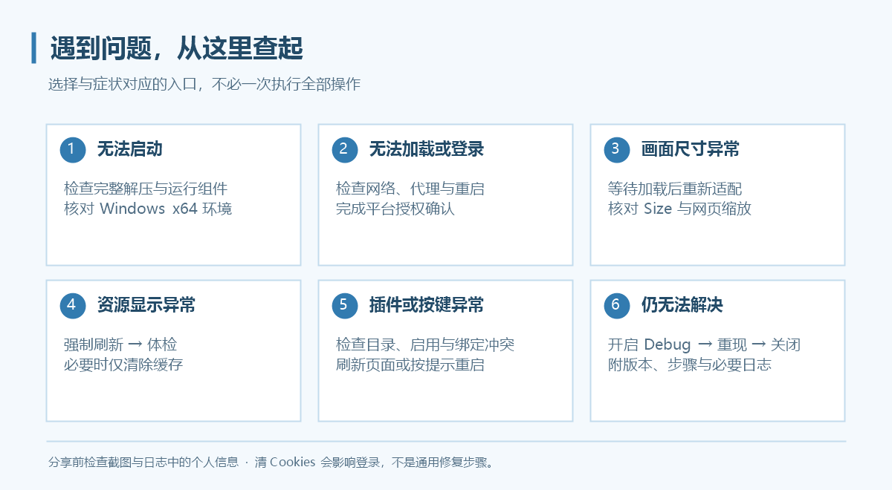

# 常见问题

先查看对应功能页。涉及网络时先检查连接和重启状态，涉及画面时先尝试重新适配或强制刷新。

## 安装与启动

### 便携版为什么也提示缺少组件？

便携版免去程序安装步骤，仍依赖 .NET 10、Windows App SDK Runtime 2.5.1、Visual C++ 与 WebView2 的 x64 运行组件。按包内 `Prerequisites.txt` 和[安装说明](install.md)核对。

### 双击后没有窗口，或提示缺少文件怎么办？

确认压缩包已完整解压、同目录文件未丢失、运行组件架构正确。不要只搬走 EXE。若是更新后的问题，关闭所有旧实例，再用完整新目录启动。

### 有自动更新吗？

有。0.3.7 起支持启动检查和“更多 → 关于”中的手动检查、下载与安装确认；新版提醒还能跳过指定版本。详情见[程序更新](updates.md)。不含更新功能的旧版需要先手动安装，仍可从 [Releases](https://github.com/rawlkian/grancypher-release/releases)下载。

## 登录问题

### 登录页打不开或一直回到登录页？

1. 核对代理软件是否运行、代理地址与端口是否正确。
2. 修改连接设置后重启 Grancypher。
3. 确认登录平台和游戏页面都能通过该连接访问。
4. 等待并完成登录确认，不要连续刷新或调整 Size。
5. 仍然失败时开启 Debug，记录失败页面与完整复现步骤。

仅在明确需要重置登录资料时使用“仅清除 Cookies”；清除后可能需要重新登录。完整流程见[第一次使用](getting-started.md)。

### 为什么换配置后要重新登录？

不同配置使用独立 Cookies。新建配置不复制旧登录资料，这是正常行为；“迁移当前配置”与“新建配置”的区别见[多用户配置](features/multi-user.md)。

### 升级后看不到原来的登录和书签？

检查当前配置目录是否与旧版相同。新版默认根目录使用 `Grancypher`，不自动识别旧 `GranblueBrowser` 默认目录。可选择有效的已有配置，或分别还原用户配置和书签；备份文件不包含 Cookies。

## 画面与窗口

### 游戏右侧有空白或窗口宽度不合适？

等待加载完成后点击“重新适配游戏画面”。可关闭页面加载自动裁剪，但 Size 变化和手动按钮仍会适配。详见[画面裁剪](features/resize.md)。

### Ctrl + 滚轮缩放是否会记住？

会，主、副视图分别记忆，范围 50%–250%，不同配置独立保存。

### 分屏能登录两个账户吗？

同一配置的分屏共用 Cookies。使用账户菜单新建配置并打开独立实例，才能隔离登录资料。

### 太郎或悬浮书签为什么自动跑到另一侧？

“附属面板自动换边”默认开启，靠近屏幕边缘时选择空间较多的一侧。可在“设置 → 外观”关闭；关闭后允许部分面板超出屏幕。

### 设置窗口太大、按钮看不到？

检查“高分辨率优化”。它适配独立窗口与系统 DPI，和游戏网页缩放是不同设置。

## 脚本与快捷键

### 太郎打开了却没有实时更新？

实时桥接需要太郎窗口保持打开。检查插件是否启用、目录顶层是否有 `manifest.json`，并尝试重启；不同插件版本的兼容表现可能不同。

### 为什么部分油猴脚本无法使用？

目前只支持部分 Tampermonkey API。核对脚本元信息、文件位置、依赖地址与所需接口，例如 `GM_xmlhttpRequest` 未实现。修改文件后重新读取、保存并刷新网页。

### 为什么按右键不显示网页菜单？

默认未启用网页右键菜单，可在“设置 → 常规”开启。若右键已绑定快捷功能，浏览器区域优先执行该功能，需要改绑或删除。

### 鼠标还有更多侧键，可以绑定吗？

原生录入支持 Mouse4／Mouse5。其他侧键先在鼠标驱动里映射为键盘按键，再在快捷键设置中录入。

### 快捷键无法保存，或老板键无效？

检查重复组合、未完成条目、书签目标与系统保留组合。老板键必须包含修饰键且仅支持键盘；与其他程序全局热键冲突时更换组合。

## 缓存与数据

### 清缓存会退出登录吗？

“仅清除缓存”和“更新缓存 / 强制刷新”不删除 Cookies。“仅清除 Cookies”和“清除全部浏览器数据”可能需要重新登录，操作前核对按钮名称。

### 缓存为什么一直增长？

静态资源缓存没有固定容量上限，不自动清理正常历史版本。使用“管理缓存版本…”预览并删除不需要的版本；磁盘不足 2 GiB 时停止新增写入。

### 开启内存热缓存后，程序内存为什么超过设定额度？

32／64／128 MiB 只限制缓存资源内容，不包括 WebView2、程序界面、临时缓冲与其他对象；每个实例独立占用。

### 可以导入其他工具的缓存吗？

当前不提供第三方缓存导入。已有第三方代理缓存的问题也不能依靠 Grancypher 清缓存保证解决。

### 设置备份可以恢复游戏登录吗？

不能。用户配置备份不含 Cookies，也不含书签与保存路径；书签需单独备份。目录迁移才会处理当前配置的登录资料。

## 问题反馈与日志

1. 在“更多 → 关于 Grancypher”记录程序版本，并记录 Windows 与 WebView2 版本。
2. 在“更多”中开启 Debug 模式。
3. 重现问题，记下时间、操作顺序、错误提示和发生问题的视图／配置。
4. 手动关闭 Debug 模式，打开当前配置目录的 `Logs/debug.log`。
5. 前往 [Issues](https://github.com/rawlkian/grancypher-release/issues/new)，附上复现步骤、必要截图与相关日志。

Debug 跨重启保持开启，结束后需要手动关闭。分享前检查日志、截图是否包含不希望公开的账号名称、邮箱或本机路径；不需要上传整个 WebView2 登录资料文件夹。

## 新版功能常见问题

### 隐藏的图标为什么不在“更多”里？

0.4.1 起，主动隐藏的图标完全移除；只有设为显示、但因空间不足溢出的工具图标进入“更多”。到“更多 → 图标管理”重新显示，见[侧栏与图标管理](features/sidebar.md)。

### 侧栏图标或分隔线拖不动？

检查“设置 → 侧栏 → 锁定侧栏布局”。书签排序由“设置 → 书签 → 允许拖拽书签排序”独立控制。

### 改名后快捷方式还该用旧名称吗？

0.4.6 起，按配置名启动应改用新名称，带空格时加引号；固定标识、目录与 Cookies 保持不变。详情见[多用户配置](features/multi-user.md)。

### 怎样静音游戏又保留太郎通知？

打开“设置 → 常规 → 游戏窗口静音”并应用。只影响主窗和双窗，太郎与其他独立窗口不受影响。

### Chrome 插件可以直接从商店安装吗？

当前仅支持包含 `manifest.json` 的解包目录，不提供商店或 CRX 安装，也不自动更新插件。权限与脚本兼容开关见[Chrome 插件支持](features/chrome-extensions.md)。

### 切到 OpenGL 后更卡怎么办？

部分 WebView2 版本可能初始化失败并回退软件渲染。改回“自动”后保存并重启；此设置不选择核显或独显，详见[实验性设置](features/experimental.md)。

### 程序无法启动时如何收集诊断？

双击发行目录中的 `Check-Grancypher.cmd`，报告默认保存在 `%TEMP%\Grancypher-Diagnostics`。网络自检不读取当前账户代理设置，代理用户需按[运行环境诊断](diagnostics.md)指定测试方式。
