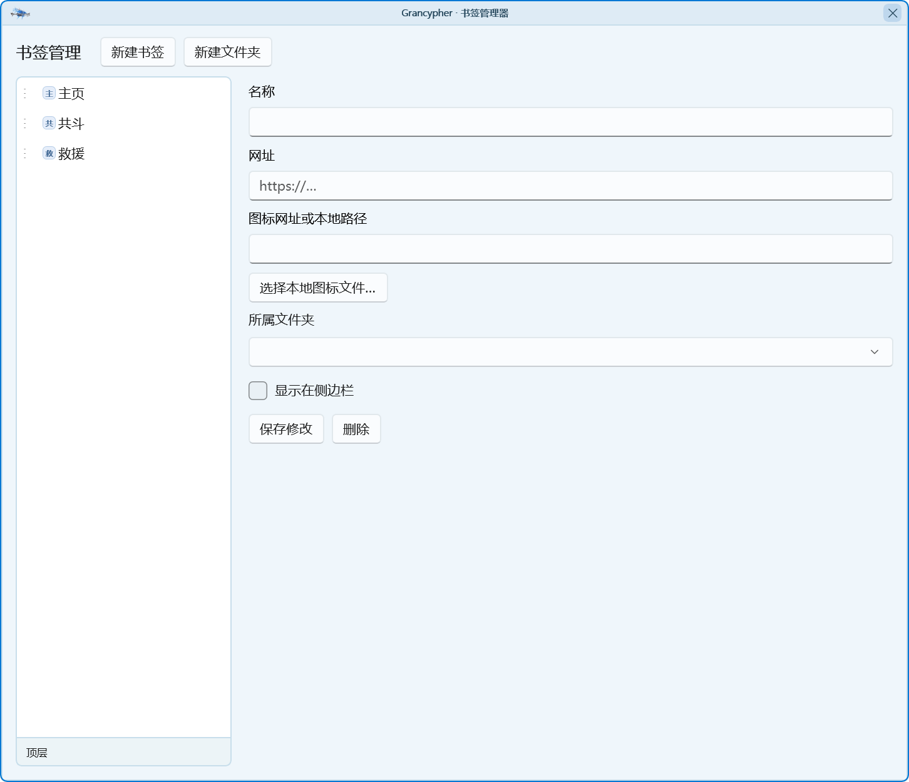
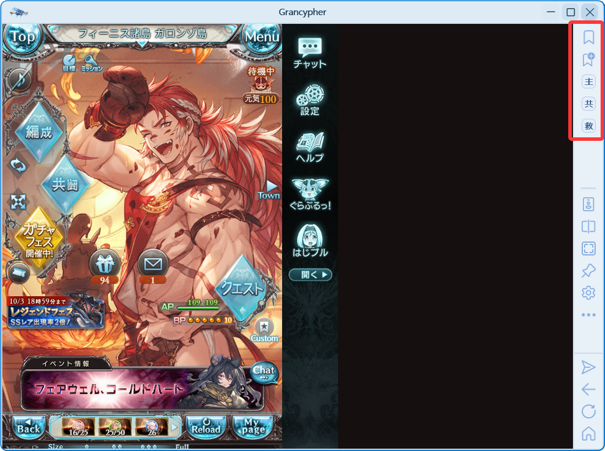
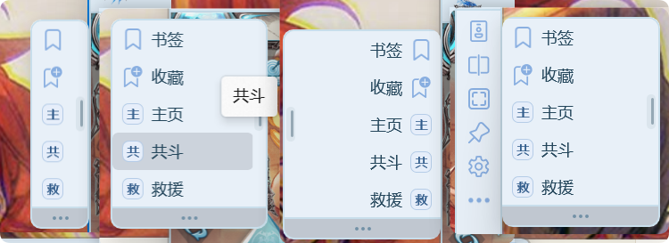
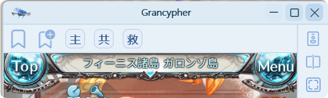

Grancypher 支持丰富的书签模式。

## 书签管理

书签栏上第一个按钮为书签管理按钮，点击会显示所有的书签与管理书签选项，点击管理书签打开对话框。

在这里可以进行书签和文件夹的新建与管理，左侧书签列表中明细项目可以拖动排序或调整文件夹层级。

书签可以设置图标，可以使用网址链接也可以选择本地图标，如果不设置则默认使用第一个全角字符。

书签管理器中可以将左侧列表中的书签拖放至书签栏上，也可以通过勾选“显示在侧边栏”实现同样的目的。

书签栏上第二个按钮为快速新增书签按钮，会快速将当前页面地址作为书签地址进行保存。

> **关于书签图标的一个小提示：**
>
> 在所有可以通过多人救援进入的副本选召唤的界面正上方，显示的血条旁，有一个 Boss 的方形图标，建议使用开发者工具获取这个图标的地址，作为对应的书签图标。

## 书签栏模式

### 聚合模式

该模式下书签栏与侧边栏合为一体。

1. 可设置工具区与书签区的上下位置关系。
2. 工具栏与书签栏之间的分隔线可以上下拖动以调节书签栏位置与空间大小。
3. 该模式下书签栏的缩放跟随侧边栏的缩放。

### 悬浮模式

书签栏作为单独的一个面板展现。

1. 可单独设置书签栏大小。
2. 可设置悬浮书签栏是否与主窗体吸附与吸附位置。
3. 可设置完整显示书签明细或仅图标，仅图标模式下鼠标悬停会产开书签面板。
4. 通过拖拽条可调整书签栏位置，可选隐藏与显示位置。
5. 侧边深色短线处可拉伸书签栏宽度。

注意：由于 WinUI 3 限制，窗体形态下无法完全隐藏边框，而悬浮窗和单明细按钮方案会消耗过多性能，因此悬浮模式下书签栏吸附在左侧时，依然按照在右侧时的方案展开面板。

### 置于顶部/底部

与 Chrome / Edge 一样，书签栏出现在主窗口的顶部或底部。

1. 可单独设置书签栏大小。
2. 可设置完整显示书签明细或仅图标，仅图标模式下鼠标悬停不会展开。
3. 最大支持显示三行，超出内容通过鼠标滚轮进行左右滑动（1行），或上下滑动（超过1行）。