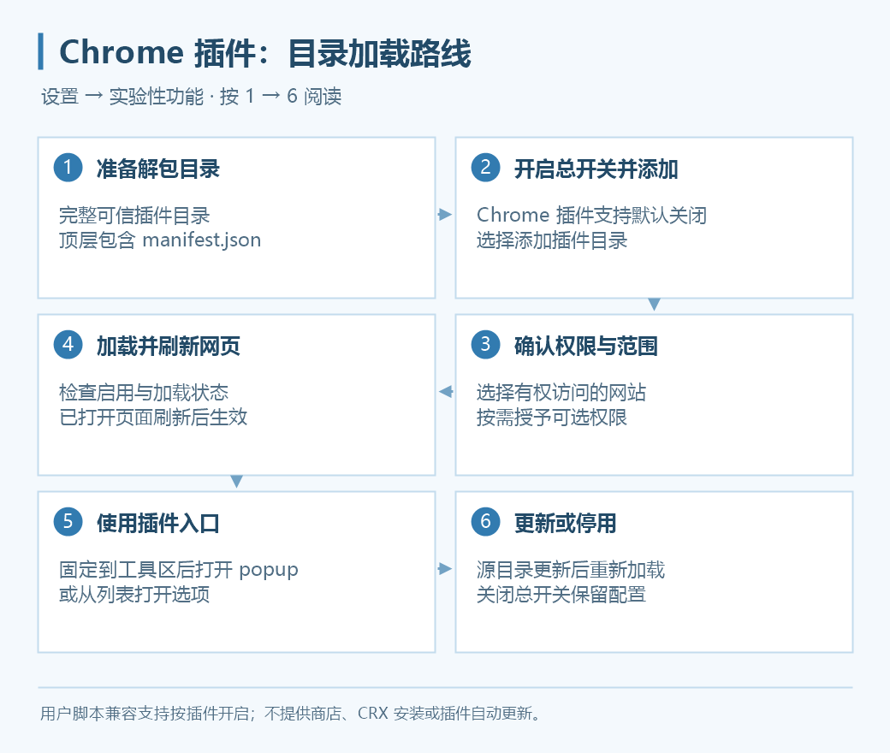

# Chrome 插件支持

0.4.0 起，Grancypher 提供实验性 Chrome 插件支持，入口在 **设置 → 实验性功能**。总开关默认关闭；太郎继续使用独立设置入口。

*上图是操作流程示意，不是设置截图。*

## 添加插件

1. 准备可信来源的完整解包目录，顶层必须有 `manifest.json`。
2. 打开“设置 → 实验性功能”，开启“Chrome 插件支持”。
3. 点击“添加插件目录…”，选择一个目录。
4. 在详情中阅读权限与网站范围，选择需要的访问范围；按需固定到工具区。
5. 确认添加并查看加载状态。需要多个插件时，重复添加。
6. 刷新已打开的目标网页，使网页脚本设置生效。

目前不提供 Chrome 商店安装、CRX 安装或插件自动更新。插件加载使用当前账户目录下的独立副本，不改写源目录；源目录更新后需要点击“重新加载”。

## 管理入口

| 操作 | 用途 |
| --- | --- |
| 启用 | 启停单个插件 |
| 固定到工具区 | 在主窗口提供插件图标入口 |
| 详情与权限 | 修改网站范围、可选权限、用户脚本兼容开关 |
| 重新加载 | 重新读取源目录，加载更新后的副本 |
| 打开选项 | 打开插件声明的设置页 |
| 移除 | 从配置中移除插件，按确认框执行 |

这些管理操作即时保存。权限变更会重新加载已启用插件；关闭总开关会停用其他插件并关闭其页面，保留配置，太郎仍可独立使用。已执行的网页脚本影响需刷新后清除。

## 网站与可选权限

“有权访问的网站”可以选择：

- **插件声明的网站**：使用插件本身声明的范围。
- **仅指定的网站**：每行输入一个完整 HTTP(S) 网址，例如 `https://game.granbluefantasy.jp/`。
- **不允许访问网站**：不向目标页面开放网站访问。

指定网站不能包含通配符、登录信息或非默认端口。文件网址默认不允许；可选 API 权限在“详情与权限”明确授予。网站范围约束插件网页访问，不是阻断插件全部网络请求的防火墙。

## Tampermonkey 与用户脚本

声明 `userScripts` 的插件可在详情中开启“用户脚本兼容支持（实验）”，让它在获准网站注册和执行脚本。已验证 Tampermonkey 5.4.1 的实际安装、获准页面执行与 GM 存储读写，不代表所有 GM 接口都兼容。

插件中的脚本由插件管理，菜单一般在其工具区入口；本地 `.user.js` 加载器仍使用“设置 → 用户脚本”和“更多 → 用户脚本”。选择一种加载方式，避免重复执行同一脚本。

## 图标、弹出菜单与选项页

点击工具区插件图标，会打开它的 popup，或执行插件定义的点击动作。popup 按内容测量尺寸，失去焦点或按 Esc 关闭，同时只打开一个。选项页和支持的侧边面板通过独立窗口展示，不嵌入游戏视图。

图标、角标数量与标题会随当前页面更新，同网址的双窗仍按实际视图区分。默认图标和自定义鼠标指针使用通用插件／CSS 接口，不依赖固定插件名称；实际能力取决于 WebView2。

图标主动隐藏后不会收纳到“更多”，需要在[图标管理](sidebar.md)重新显示。

## 书签与音量插件

- 声明并获准 `bookmarks` 权限的插件，可读取当前配置的书签树、层级及搜索结果；目前只读，不提供插件修改书签与完整变更事件。
- 声明并获准音频捕获权限的插件，需要先点击工具区入口取得当前视图授权；可用于音量放大或静音。目前支持音频，不支持完整 Chrome 视频捕获能力。
- 停用、重载或跨站导航会撤销旧捕获授权。音频传输可能有延迟与编码差异，具体插件效果需要核对。

只希望静音游戏并保留太郎通知时，使用“设置 → 常规 → 游戏窗口静音”即可，不必安装音量插件。

## 兼容问题排查

先检查总开关、启用状态、网站访问权限与固定图标，再刷新目标页面；源目录变化时重新加载。必要时开启 Debug 并记录插件版本、加载错误与复现步骤。

当前不等同完整 Chrome：扩展快捷键、全部标签页／窗口行为及所有 GM API 不保证支持。扩展静默调试与浏览器身份设置见[实验性设置](experimental.md)。
