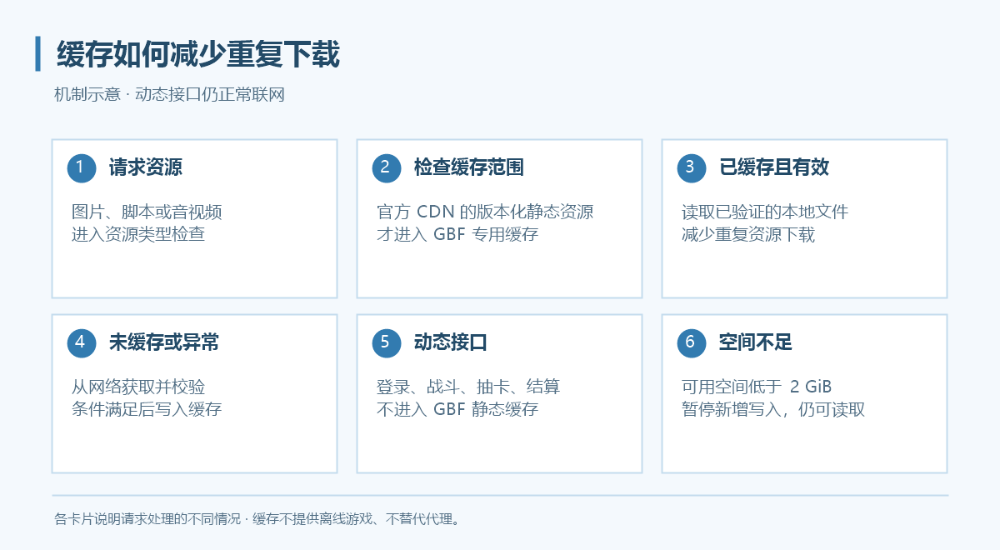
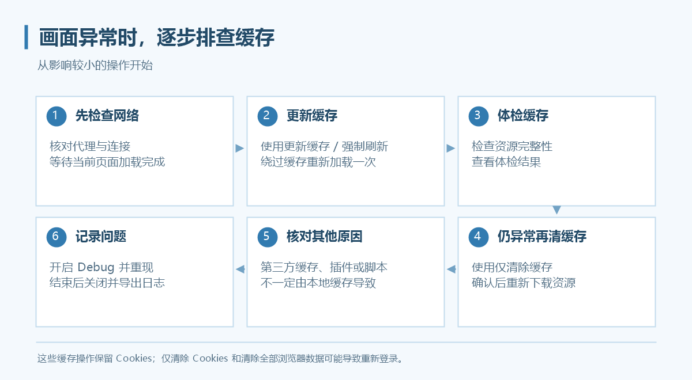

# 本地缓存

入口：**设置 → 数据与缓存**。当前新配置默认开启 GBF 静态资源缓存；可选的内存热缓存、游戏资源预拉取和常用页面预热默认关闭。

*上图是缓存机制示意，不是设置界面截图。*

## 缓存保存什么

程序在 WebView2 原生缓存之上管理官方 CDN 的版本化静态资源，例如图片、脚本与音视频。登录、战斗、抽卡、购买和结算等动态接口不会进入 GBF 静态资源缓存。

缓存不提供离线游戏，不替代代理服务，也不需要安装根证书。资源写入与读取前会进行完整性检查，异常资源清理后重新从网络获取。

## 容量与共享

- 静态缓存**没有固定总容量上限**，不会自动淘汰正常历史版本。
- 磁盘可用空间低于 **2 GiB** 时暂停新增写入，已有缓存仍可读取；空间恢复后可继续写入。
- 不同账户可使用相同缓存目录，但登录资料仍各自保存。
- 改变静态资源缓存开关或缓存目录需要重启。

## 选择可选加速功能

| 设置 | 默认 | 作用与取舍 |
| --- | --- | --- |
| 内存热缓存 | 关闭 | 把已验证的小型非音视频资源放入内存，减少磁盘读取；可选 32／64／128 MiB |
| 游戏资源预拉取 | 关闭 | 空闲时从已加载静态 JS／JSON 的明确引用中准备相关小资源，可能增加流量 |
| 常用页面预热 | 关闭 | 学习首页、任务、编队、仓库等固定类别的切换，提前准备已知静态资源 |
| 暂停后台资源下载 | 关闭 | 暂停主动后台读取；正常浏览请求和已有缓存读取不受影响 |

可选功能点击“应用”后生效。资源预拉取与页面预热需开启静态资源缓存，不要求启用内存热缓存；三者可以独立开关。

内存额度只针对缓存资源内容，每个运行实例独立计算，并非程序总内存上限。预拉取与预热不自动操作游戏、不请求动态 API，但可能增加静态下载流量，不承诺零封号风险。

后台会优先让前台加载，导航忙碌或受保护／未知游戏页面会让主动下载等待。音视频首次分段加载时，后台可能额外下载一次完整文件以补齐缓存；“暂停”是协作式暂停，不是网络带宽硬限速。

## 查看效果

1. 打开“设置 → 数据与缓存”，找到“缓存统计”。
2. 点击“刷新统计”，查看本次与累计命中、容量、磁盘空间及后台任务等信息。
3. 正常访问常用页面后再观察，首次加载未命中属于正常情况。

命中高也不代表所有等待都消失：动态接口、网络延迟和页面处理仍可能影响体验。

## 遇到图片错乱或资源加载异常

先确认代理与网络正常，再按以下顺序处理：

1. **更新缓存 / 强制刷新**：让当前游戏窗口绕过缓存重新加载一次，不清除 Cookies。
2. **体检缓存**：检查资源完整性，查看统计页体检结果；异常资源可重新回源。
3. 仍有缓存问题时，使用**仅清除缓存**并确认，下次访问会重新下载。

如另有第三方代理缓存，Grancypher 的强制刷新不能保证同时清理第三方缓存。

## 清理旧版本

1. 点击“管理缓存版本…”。
2. 查看版本、文件数量、大小与使用情况，选择不再需要的版本。
3. 先预览，再确认删除。

近期仍使用的版本建议保留。删除后若游戏仍需要这些资源，会再次联网下载。预览后新增、变化或被使用的文件可能被跳过，以最终结果为准。

## 清除操作的区别

| 按钮 | 影响 |
| --- | --- |
| 更新缓存 / 强制刷新 | 重新加载，保留 Cookies |
| 仅清除缓存 | 清除资源缓存，不删除 Cookies；再次加载需下载资源 |
| 仅清除 Cookies | 影响登录状态，可能需要重新登录 |
| 清除全部浏览器数据 | 清除浏览器资料，可能需要重新登录 |

清除操作会影响当前配置内的游戏窗口；共享缓存被清理后，其他使用该目录的配置也会重新下载资源。只排查画面问题时，不要把“清除全部浏览器数据”当成第一步。
