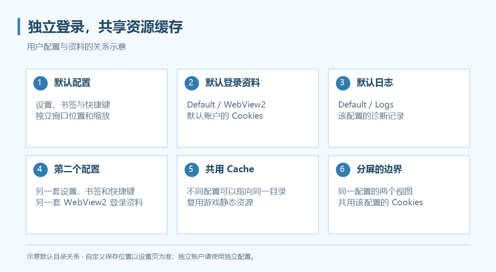
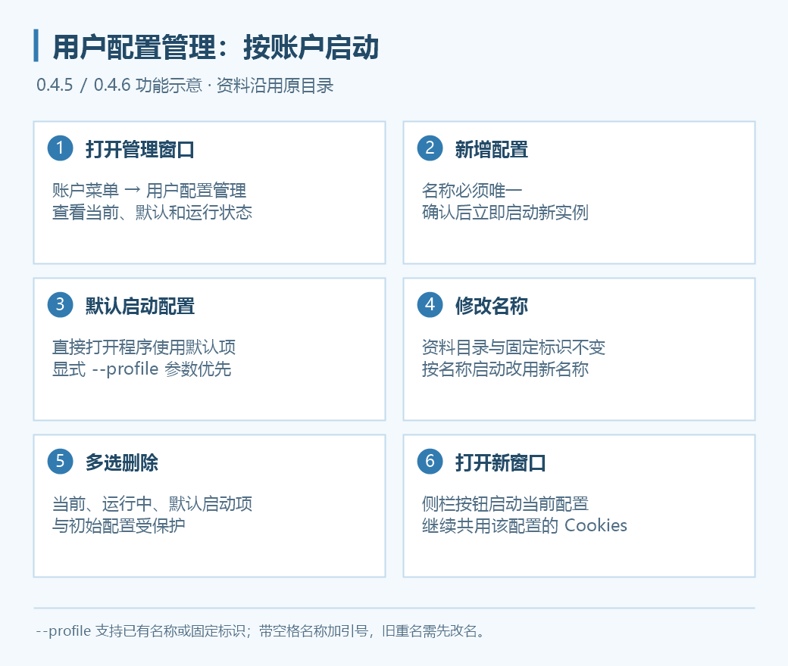
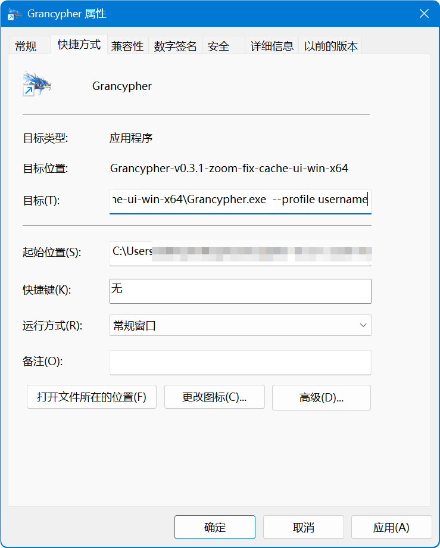
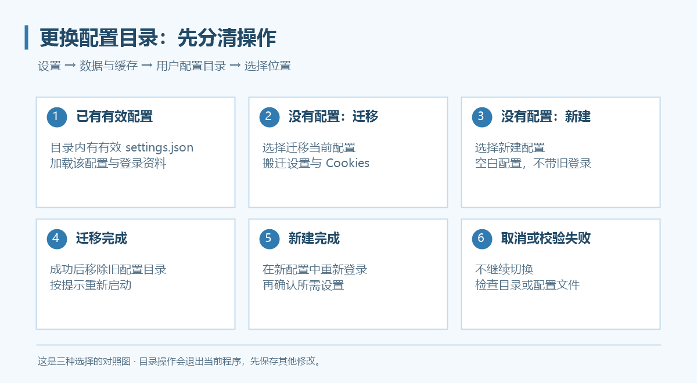

# 多用户配置

多用户配置用于隔离不同游戏账户的登录资料、程序设置、书签、快捷键、缩放与窗口位置。多个配置可以共用资源缓存，节约磁盘空间。



## 从账户菜单新建



*上图为新版功能示意。0.4.5 起新增集中管理窗口，配置菜单中的启动入口改为“启动此配置”。*

1. 点击工具区顶部的账户按钮。
2. 选择“用户配置管理…”，通过新增入口输入名称并确认；也可使用账户菜单的“新建账户配置…”。
3. 新增成功后会立即启动对应实例；已有配置可在账户子菜单点击“启动此配置”。
4. 在新实例中登录对应游戏账户。

新配置不复制当前账户的 Cookies，默认共用缓存。创建 Grancypher 配置不会替你注册游戏账户。

“更改用户配置名…”或管理窗口的修改名称操作不改变目录、Cookies 或固定标识。0.4.6 起，`--profile` 既可使用固定标识，也可使用已有配置名；按名称启动的快捷方式应在改名后使用新名称，按固定标识启动的快捷方式不受影响。

## 用快捷方式启动指定配置



1. 为 `Grancypher.exe` 创建快捷方式。
2. 右键快捷方式，打开“属性”。
3. 在“目标”栏的程序路径后追加 `--profile` 与已有配置名或固定标识。
4. 保存并双击启动。

```text
"D:\Apps\Grancypher\Grancypher.exe" --profile "Account2"
```

路径替换为自己的程序位置。带空格的配置名用双引号包住，例如 `--profile "我的 GBF"`。已有名称匹配会忽略大小写与首尾空格，沿用原资料目录和 Cookies，不会另建同名配置。

新增和改名都不能重名，也不能占用其他配置的固定标识。旧版本已有的重名项不会自动合并；按重名名称启动时会提示先改名，仍可用明确的固定标识启动对应配置。

## 资料保存在哪里

默认根目录为 `%LOCALAPPDATA%\Grancypher`，在资源管理器地址栏输入即可打开。没有自定义目录时，资料关系如下：

```text
Grancypher/
├─ Profiles/
│  ├─ Default/             初始配置（保留为恢复入口）
│  │  ├─ settings.json     程序设置
│  │  ├─ bookmarks.json    书签
│  │  ├─ WebView2/          Cookies 与浏览器资料
│  │  └─ Logs/             日志
│  └─ Account2/            另一个配置
└─ Cache/                  可共享缓存
```

**实际路径以“设置 → 数据与缓存”显示为准。** 用户可选择其他配置目录，旧版本迁移资料也可能保留原位置。

## 更换用户配置目录

在 **设置 → 数据与缓存 → 用户配置目录 → 选择位置…** 选择文件夹。这个入口会进入切换／迁移流程并退出当前程序，操作前先保存其他未应用的设置。



| 所选目录 | 结果 |
| --- | --- |
| 已有有效 `settings.json` | 加载该目录的配置与 WebView2 登录资料 |
| 没有配置，选择“迁移当前配置” | 迁移当前设置和 Cookies，成功后移除旧配置目录 |
| 没有配置，选择“新建配置” | 创建空白配置，不带旧 Cookies；需要重新登录 |
| 取消 | 不切换 |

文件存在但格式无效时，程序会报错，不能按有效配置加载。不要选择另一个正在使用的配置目录；按程序检查和提示处理。

## 更换缓存目录

更改缓存目录后保存，按提示选择是否复制原缓存。复制时会显示文件进度，完成后按提示重启。不迁移时从新目录开始积累缓存，原缓存不会因此自动删除。

多个配置可以选择同一个缓存目录；不要让缓存目录与 Cookies 目录相同或相互包含。共享目录的变更需要核对其他配置仍使用的位置。

## 备份和迁移有什么不同

| 操作 | 是否带登录资料 |
| --- | --- |
| 备份／还原用户配置 | 不含 Cookies，不含书签与保存路径；还原覆盖当前配置设置，保留当前登录资料 |
| 备份／还原书签 | 单独处理书签，不带 Cookies |
| 迁移当前配置目录 | 迁移配置与 Cookies，属于移动操作 |

跨电脑使用备份时，需要重新登录，并重新确认插件、脚本、本地图标等外部文件位置；不要把设置备份当成完整账户资料备份。

## 删除不用的配置

关闭对应实例后，可在账户子菜单选择“删除账户配置…”，或在“用户配置管理”中多选后批量删除。初始 `Default` 配置、当前配置、运行中的配置和所选默认启动配置均不能删除。

删除会移除该账户配置文件夹和 Cookies，无法撤销。程序会检查缓存是否共用；共用缓存保留，独占缓存可按确认框选择是否一并删除。删除前分别备份所需设置和书签。

## 设置默认启动配置

在账户菜单打开“用户配置管理…”，选中希望日常使用的配置并设置为默认启动项。直接启动 `Grancypher.exe` 时会使用它；显式传入 `--profile` 时，参数优先。

默认启动项使用固定标识保存到 `%LOCALAPPDATA%\Grancypher\startup-profile.json`。改名不影响该选择，设置默认项也不会移动或复制账户资料。默认项失效时回退到初始配置。

## 打开当前配置的新窗口

侧栏工具区的“打开新窗口”默认位于置顶按钮下方，启动当前配置的新实例，继续使用同一份登录资料。这不是创建独立账户；需要不同登录时仍应新增配置。按钮支持[图标管理与排序](sidebar.md)。
