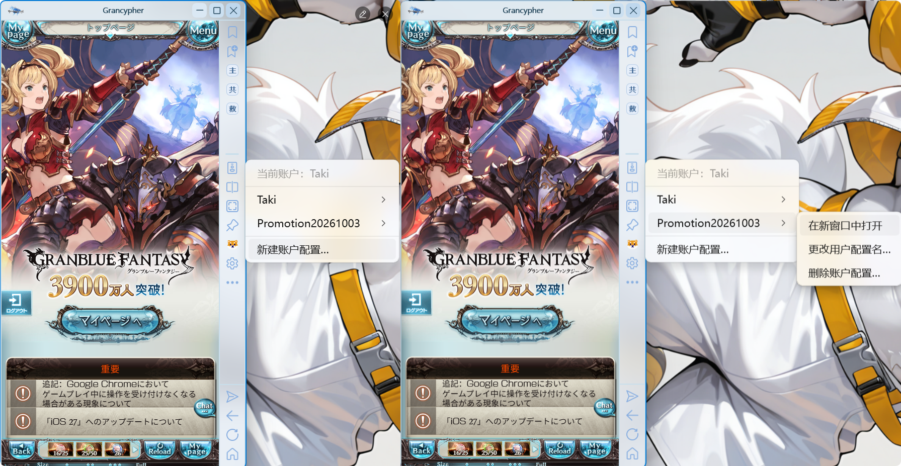

# 多用户配置

多用户配置用于隔离不同游戏账户的登录资料、程序设置、书签、快捷键、缩放与窗口位置。多个配置可以共用资源缓存，节约磁盘空间。


## 从账户菜单新建



1. 点击工具区顶部的账户按钮。
2. 选择“新建账户配置…”，输入名称并确认。
3. 再次打开账户菜单，进入该配置子菜单，点击“在新窗口中打开”。
4. 在新实例中登录对应游戏账户。

新配置不复制当前账户的 Cookies，默认共用缓存。创建 Grancypher 配置不会替你注册游戏账户。

“更改用户配置名…”只修改显示名称，不改变目录、Cookies 或启动标识；已有快捷方式仍使用原启动标识。

## 用快捷方式启动指定配置


1. 为 `Grancypher.exe` 创建快捷方式。
2. 右键快捷方式，打开“属性”。
3. 在“目标”栏的程序路径后追加 `--profile` 与配置标识。
4. 保存并双击启动。

```text
"D:\Apps\Grancypher\Grancypher.exe" --profile "Account2"
```

路径替换为自己的程序位置。账户菜单改过显示名称后，不要把新显示名称误当成原启动标识。

## 资料保存在哪里

默认根目录为 `%LOCALAPPDATA%\Grancypher`，在资源管理器地址栏输入即可打开。没有自定义目录时，资料关系如下：

```text
Grancypher/
├─ Profiles/
│  ├─ Default/             默认配置
│  │  ├─ settings.json     设置与书签
│  │  ├─ WebView2/          Cookies 与浏览器资料
│  │  └─ Logs/             日志
│  └─ Account2/            另一个配置
└─ Cache/                  可共享缓存
```

**实际路径以“设置 → 数据与缓存”显示为准。** 用户可选择其他配置目录，旧版本迁移资料也可能保留原位置。

## 更换用户配置目录

在 **设置 → 数据与缓存 → 用户配置目录 → 选择位置…** 选择文件夹。这个入口会进入切换／迁移流程并退出当前程序，操作前先保存其他未应用的设置。


| 所选目录 | 结果 |
| --- | --- |
| 已有有效 `settings.json` | 加载该目录的配置与 WebView2 登录资料 |
| 没有配置，选择“迁移当前配置” | 迁移当前设置和 Cookies，成功后移除旧配置目录 |
| 没有配置，选择“新建配置” | 创建空白配置，不带旧 Cookies；需要重新登录 |
| 取消 | 不切换 |

文件存在但格式无效时，程序会报错，不能按有效配置加载。不要选择另一个正在使用的配置目录；按程序检查和提示处理。

## 更换缓存目录

更改缓存目录后保存，按提示选择是否复制原缓存。复制时会显示文件进度，完成后按提示重启。不迁移时从新目录开始积累缓存，原缓存不会因此自动删除。

多个配置可以选择同一个缓存目录；不要让缓存目录与 Cookies 目录相同或相互包含。共享目录的变更需要核对其他配置仍使用的位置。

## 备份和迁移有什么不同

| 操作 | 是否带登录资料 |
| --- | --- |
| 备份／还原用户配置 | 不含 Cookies，不含书签与保存路径；还原覆盖当前配置设置，保留当前登录资料 |
| 备份／还原书签 | 单独处理书签，不带 Cookies |
| 迁移当前配置目录 | 迁移配置与 Cookies，属于移动操作 |

跨电脑使用备份时，需要重新登录，并重新确认插件、脚本、本地图标等外部文件位置；不要把设置备份当成完整账户资料备份。

## 删除不用的配置

关闭对应实例后，在账户子菜单选择“删除账户配置…”。默认配置、当前配置及正在使用的配置不能删除。

删除会移除该账户配置文件夹和 Cookies，无法撤销。程序会检查缓存是否共用；共用缓存保留，独占缓存可按确认框选择是否一并删除。删除前分别备份所需设置和书签。
