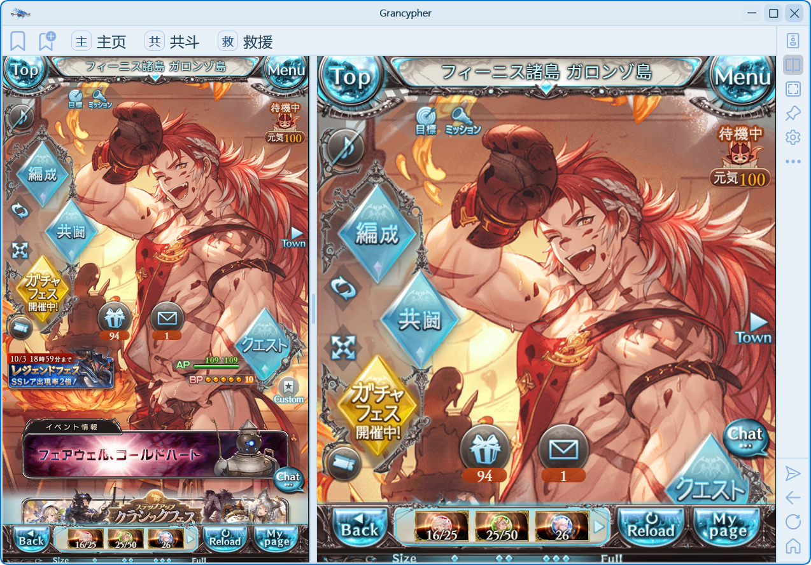

# 自适应画面裁剪

画面裁剪用于收窄多余区域；网页缩放用于改变内容大小；高分辨率优化用于让设置等独立窗口适应系统缩放。这三项可以分别调整。

## 自动裁剪如何工作

程序根据实际游戏画布宽度适配窗口，并隐藏 Mobage 侧栏。默认开启“页面加载时自动裁剪游戏右侧内容区域”。双窗口模式下会分别处理两个视图。

可以在 **设置 → 外观** 关闭该开关：

| 操作 | 开启自动裁剪 | 关闭自动裁剪 |
| --- | --- | --- |
| 页面加载时适配游戏右侧区域 | 自动执行 | 不自动执行 |
| 隐藏 Mobage 条 | 保持处理 | 保持处理 |
| 切换游戏底部 Size 档位 | 自动适配 | 仍自动适配 |
| 点击侧栏“重新适配游戏画面” | 可用 | 仍可用 |

## 手动重新适配

1. 等待游戏页面加载完成。
2. 点击侧栏的“重新适配游戏画面”按钮。
3. 如为分屏，等待两侧完成测量再查看窗口宽度。

窗口出现多余空白或更换 Size 后尺寸不合适时，可先尝试此操作。登录确认期间请先完成授权，再调整画面。

## 改变内容大小

- 游戏底部 **Size**：使用游戏自己的档位；变更时始终触发适配。
- **Ctrl + 鼠标滚轮**：调整当前视图网页缩放，范围 **50%–250%**。
- 主、副视图独立记忆网页缩放，当前配置关闭重开后恢复；不同配置分别保存。

高 DPI 显示器上的设置窗口过大，应检查“高分辨率优化”，不需要靠游戏缩放解决。更多说明见[设置](settings.md)。
