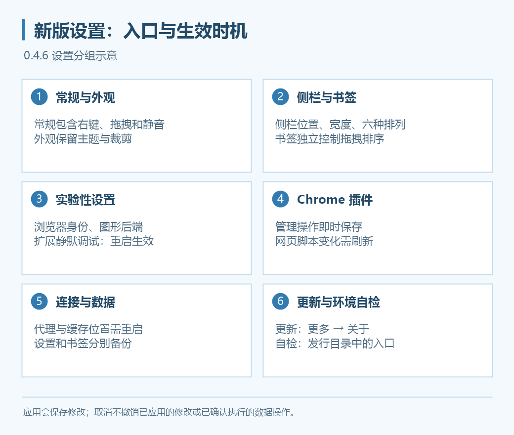

# 设置

点击侧栏齿轮打开独立设置窗口，使用左侧导航跳到相应分组。

## 保存与生效

- **应用**：保存当前修改，设置窗口继续打开。
- **保存并关闭**：保存修改并关闭设置窗口。
- **取消**：不应用尚未保存的普通表单修改；已经应用的修改、已确认执行的迁移／清除操作不会被撤销。

目录迁移、备份还原与清除按钮有独立操作流程。按确认框提示执行，不要把关闭设置窗口理解为撤销这些操作。

| 修改类型 | 如何生效 |
| --- | --- |
| 常规、外观、侧栏、书签、快捷键 | 保存／应用后生效 |
<<<<<<< HEAD
=======
| 游戏窗口静音 | 应用后立即影响主窗和双窗 |
| 浏览器身份、图形后端、扩展静默调试 | 保存后重启生效 |
| Chrome 插件管理与权限 | 管理操作即时保存；网页脚本影响需刷新页面 |
>>>>>>> 77ca4d0 (更新 Wiki)
| 用户脚本 | 保存后在新页面生效，刷新或重新导航 |
| 内存热缓存、预拉取、预热、后台暂停 | 应用后生效 |
| 代理、静态缓存开关、缓存目录、扩展静默调试 | 重启后生效 |
| 用户配置目录切换／迁移 | 使用独立流程，退出并重新打开程序 |
| 还原用户配置／书签 | 按提示重启后完整生效 |

## 常规

**界面语言**：简体中文、繁体中文、英语、日语。只改变应用界面，不改变游戏网页的语言与字体；部分翻译可能存在不准确之处。

**主页地址**：导航区主页按钮的目标，默认是 `https://game.granbluefantasy.jp/#mypage`。与速达网址分别保存。

<<<<<<< HEAD
=======
## 常规中的操作优化

>>>>>>> 77ca4d0 (更新 Wiki)
“启用网页右键菜单”和“允许拖拽图片等网页元素”默认关闭，按需求开启。若右键已绑定快捷功能，浏览器区域会优先执行快捷功能。

太郎原生打开侧栏／窗口的右键入口已隐藏，请使用 Grancypher 工具区太郎入口。开启右键菜单不等于恢复这些入口。

## 连接

系统代理、直连、手动代理、PAC。保存后重启，详细步骤见[代理设置](../proxy.md)。

## 外观

| 项目 | 说明 |
| --- | --- |
| 窗口透明度 | 调整浏览器与弹出窗口透明度，独立设置窗口不受影响 |
| 高分辨率优化 | 默认开启，按系统 DPI 调整独立窗口尺寸，不改变游戏网页缩放 |
| 页面加载时自动裁剪 | 默认开启；关闭后仍处理 Mobage 条、Size 变化和手动适配 |
| 附属面板自动换边 | 默认开启，屏幕边缘空间不足时调整太郎／吸附悬浮书签的侧别 |
| 颜色模式 | 亮色、暗色或跟随系统 |
| 强调色 | 七色预设或自定义；亮暗模式共用所选强调色 |
| 窗口材质 | 纯色、Mica、Mica Alt、亚克力，可调材质效果 |
| 未激活时保持材质 | 默认关闭；开启后仍受系统透明效果、省电与硬件条件限制 |

侧栏位置与宽度已移到独立的“侧栏”分类，详见[侧栏与图标管理](sidebar.md)。

关闭附属面板自动换边后，会保持吸附侧和宽度；屏幕边缘可能遮住部分面板。材质看不出效果时先检查系统透明效果与所选材质，不要反复清除浏览器数据。

<<<<<<< HEAD
## 侧栏

侧栏位置与宽度在此分类调整：可选左侧或右侧，宽度为 28–68 px，默认 34 px，按钮与聚合书签一起缩放。

书签、工具、导航支持全部六种上下排列。两条分隔线分别调整相邻区域的空间；导航区保留显示全部可见图标所需的高度。非聚合书签区或完全隐藏的导航区会省略。

开启“锁定侧栏布局”后，不能拖动分隔线或调整工具、导航图标顺序；书签排序由“书签”中的独立开关控制。

“更多 → 图标管理”可分别控制导航、工具和插件图标，支持预览与全部显示。隐藏的图标完全移除，不出现在“更多”；仍设为显示但因空间不足溢出的工具图标会进入“更多”。工具与导航可分别拖拽排序，“更多”固定在工具区末尾。

设置窗口会根据分类内容与屏幕缩放计算初始高度；屏幕空间不足时，左侧分类栏可以滚动。

## 实验性功能

“扩展静默调试”默认开启，隐藏其它插件的调试提示；修改后重启生效。太郎在 Grancypher 中始终通过宿主静默接收战斗数据，不受此开关影响。

=======
>>>>>>> 77ca4d0 (更新 Wiki)
## 书签、太郎、用户脚本与快捷键

- [书签管理](bookmarks.md)：布局、大小、固定项目和文件夹。
- [太郎与用户脚本](tarou-js.md)：插件目录、窗口吸附、脚本启停与菜单。
- [快捷键与速达键](shortcuts.md)：键盘、鼠标、老板键和指定书签。

## 数据与缓存

用户配置目录保存设置与 Cookies；缓存目录可跨配置共用。不要把二者设为同一个目录或互相包含的目录。

配置迁移和删除的注意事项见[多用户配置](multi-user.md)。静态缓存、统计、后台下载与清理见[本地缓存](local-cache.md)。

### 分别备份设置与书签

1. 点击“备份用户配置…”，选择文件保存位置。
2. 再点击“备份书签…”，单独保存书签文件。
3. 在目标配置使用对应的还原按钮，核对文件并按提示重启。

用户配置备份不包含 Cookies、书签与保存路径。还原用户配置覆盖**当前账户**设置，保留当前目录、书签与登录资料。插件、脚本和本地图标的外部文件不等于已被复制，换机后需核对路径。

## Debug 模式

Debug 入口在主窗口**工具区 → 更多**菜单，开启后跨重启持续记录。重现问题后手动关闭，再按提示打开日志或所在目录。

日志位置为当前配置目录的 `Logs/debug.log`。反馈前核对程序与 WebView2 版本、复现步骤，并检查日志中的账号名称、本机路径等信息。详细反馈清单见[常见问题](../faq.md#diagnostics)。

## 游戏窗口静音

0.4.5 起，在“常规”中开启“游戏窗口静音”，点击“应用”后立即静音主窗和双窗。关闭后解除该设置的静音；太郎通知、登录弹窗及其他独立窗口不受影响。开关按用户配置保存，默认关闭。

## 实验性功能

- [Chrome 插件支持](chrome-extensions.md)：目录加载、网站权限、用户脚本兼容开关、popup 与选项页。
- [实验性设置](experimental.md)：浏览器身份（UA）、图形后端（ANGLE）与扩展静默调试；这三项修改后需重启。

## 程序更新与环境检查

“更多 → 关于”中的更新功能不在偏好设置窗口内，详见[程序更新](../updates.md)。发行目录中的 `Check-Grancypher.cmd` 用于生成环境报告，详见[运行环境诊断](../diagnostics.md)。
