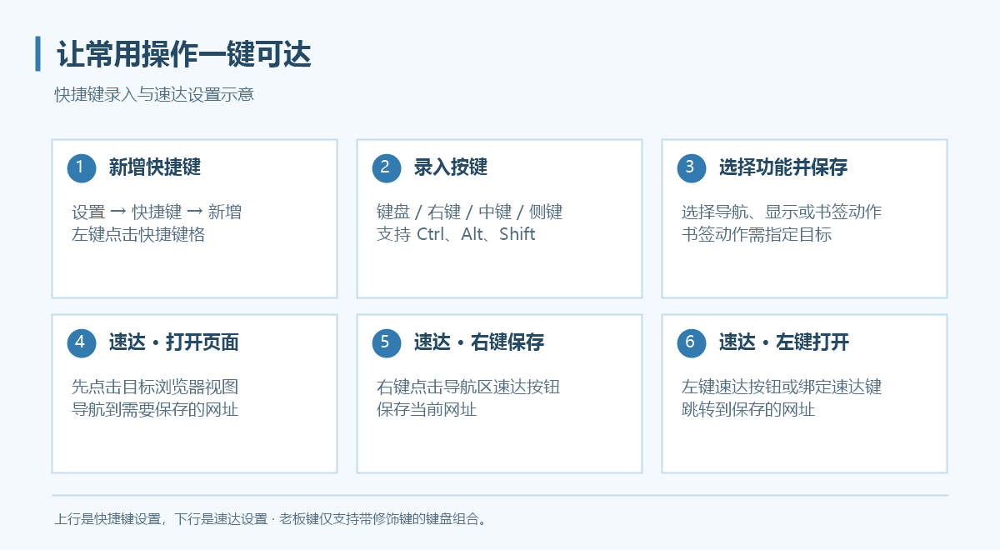

# 快捷键与速达键

快捷键在 **设置 → 快捷键** 中添加。你可以给同一功能配置多个组合，也可以用鼠标右键、中键或侧键触发常用操作。

## 添加一条快捷键

1. 点击“＋ 新增”。
2. 左键点击新行的“快捷键”格，使其进入录入状态。
3. 按下需要的键盘组合，或按鼠标右键、中键、Mouse4／Mouse5。
4. 在“功能”列选择动作；选择书签功能时再选择目标书签。
5. 点击“应用”或“保存并关闭”，回到浏览器测试。

支持 `Ctrl`、`Alt`、`Shift` 组合；录入时按 `Esc` 清空。未完成的条目需填写完整或删除，否则无法保存。

## 可绑定功能

| 类别 | 功能 |
| --- | --- |
| 导航 | 返回、前进、刷新、主页、速达 |
| 显示 | 增加透明度、降低透明度、切换透明状态、老板键 |
| 书签 | 打开指定书签 |

以下仅为**自定义示例，不是默认快捷键**：`Mouse4 → 返回`、`Mouse5 → 前进`、`Ctrl+Alt+H → 老板键`。选择不与自己常用软件冲突的组合。

## 鼠标与键盘的使用范围

已绑定的鼠标键在浏览器区域执行快捷功能并拦截原有操作；未绑定时保留原有操作。侧栏、书签栏和窗口按钮保留自身鼠标交互。

例如将右键绑定刷新后，浏览器区域右键就会优先刷新，不能同时期待它弹出网页右键菜单。

更多厂商侧键可在鼠标驱动中映射成键盘按键，再录入设置。网页输入框、文本框等编辑区域不会按普通网页快捷键处理，以减少打字时误触。

## 老板键

老板键用于切换窗口隐藏／恢复，属于全局快捷键。它必须是**至少包含一个修饰键的键盘组合**，不能用鼠标键或单独字母。

同一组合不能绑定多个功能；`Alt+Tab`、Windows 键等系统保留组合不能用于此处。全局组合若被其他程序占用，需要换一个组合并重新测试。

## 设置速达网址

速达位于导航区顶部，与主页、书签分开保存：

1. 打开需要保存的页面；分屏时先点击目标视图。
2. **右键点击速达按钮**，将当前网址保存为速达。
3. **左键点击速达按钮**，打开已保存网址。
4. 若需按键打开，在快捷键设置中绑定“速达”。

速达网址按用户配置分别记忆。替换速达只需在新页面再次右键保存。

Ctrl + 滚轮是网页缩放操作，说明见[自适应画面裁剪](resize.md)。
