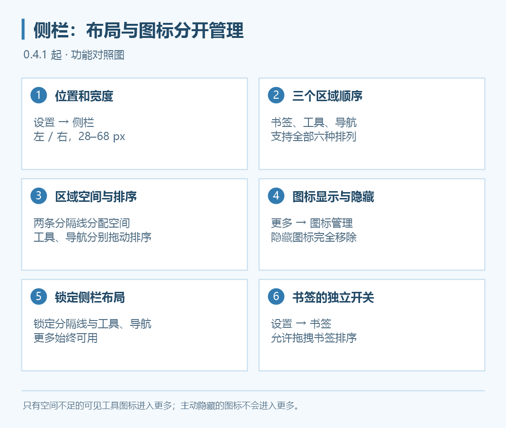

# 侧栏与图标管理

0.4.1 起，侧栏位置、宽度和区域排列集中在 **设置 → 侧栏**；图标是否显示在 **工具区 → 更多 → 图标管理**中设置。所有配置按账户保存。

*上图为功能示意。更多始终可用，旧截图的区域和按钮顺序可能与你的配置不同。*

## 调整位置、宽度和区域顺序

1. 打开“设置 → 侧栏”。
2. 选择侧栏在左侧或右侧，调整宽度。
3. 在“区域顺序（从上到下）”选择书签、工具、导航三组的顺序。
4. 应用或保存设置。

宽度范围仍为 **28–68 px**，默认 **34 px**，侧栏按钮与聚合书签随宽度缩放。三个区域支持全部六种排列：

| 排列 | 从上到下 |
| --- | --- |
| 1 | 书签 → 工具 → 导航 |
| 2 | 书签 → 导航 → 工具 |
| 3 | 工具 → 书签 → 导航 |
| 4 | 工具 → 导航 → 书签 |
| 5 | 导航 → 书签 → 工具 |
| 6 | 导航 → 工具 → 书签 |

书签栏未聚合到侧栏时，省略书签区。导航按钮全部隐藏时，省略导航区及多余分隔线。

## 调整区域空间与图标顺序

布局未锁定时，可以拖动两条分隔线调整相邻区域的空间。导航区会保留显示全部可见图标所需的高度，不会被挤到无法显示。

工具和导航图标可分别上下拖动排序，只显示落点线：首个图标允许放在前面，其他图标按落点放在后面。“更多”固定在工具区最后，不能拖动或隐藏。

## 显示、隐藏与溢出

“更多 → 图标管理”按导航、工具和插件分组，显示图标预览、显示数量与开关，并提供全部显示。确认保存后立即生效；取消不改变原配置。

| 状态 | 去哪里找 |
| --- | --- |
| 开关设为显示且空间够 | 显示在对应侧栏区域 |
| 工具图标设为显示，但空间不足 | 收纳到“更多” |
| 开关主动设为隐藏 | 完全移除，不进入“更多” |

找不到按钮时，先在图标管理中重新显示。插件是否固定到工具区与图标显示设置都需要核对，详见[Chrome 插件支持](chrome-extensions.md)。

## 两个独立的锁定开关

| 开关 | 控制范围 |
| --- | --- |
| 设置 → 侧栏 → 锁定侧栏布局 | 两条分隔线、工具图标和导航图标的拖拽 |
| 设置 → 书签 → 允许拖拽书签排序 | 书签区的拖拽排序，不受侧栏锁定影响 |

如果只想固定工具布局、继续整理书签，可以锁定侧栏并保留书签排序开启。

## 打开新窗口

0.4.5 起新增“打开新窗口”，默认位于置顶按钮下方，可排序或隐藏。它启动**当前配置**的新实例，共用该配置资料；独立账户请使用[用户配置管理](multi-user.md)。
