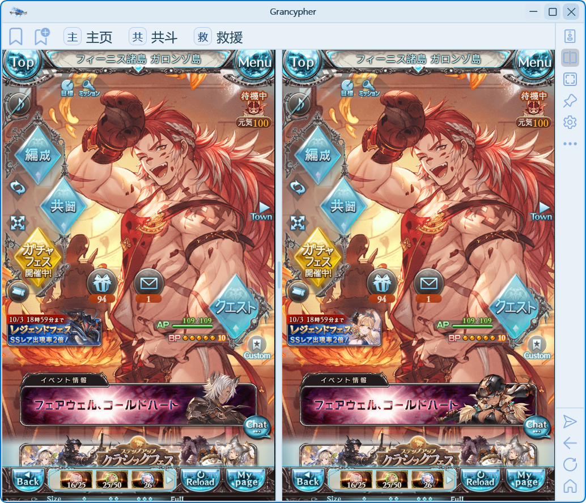
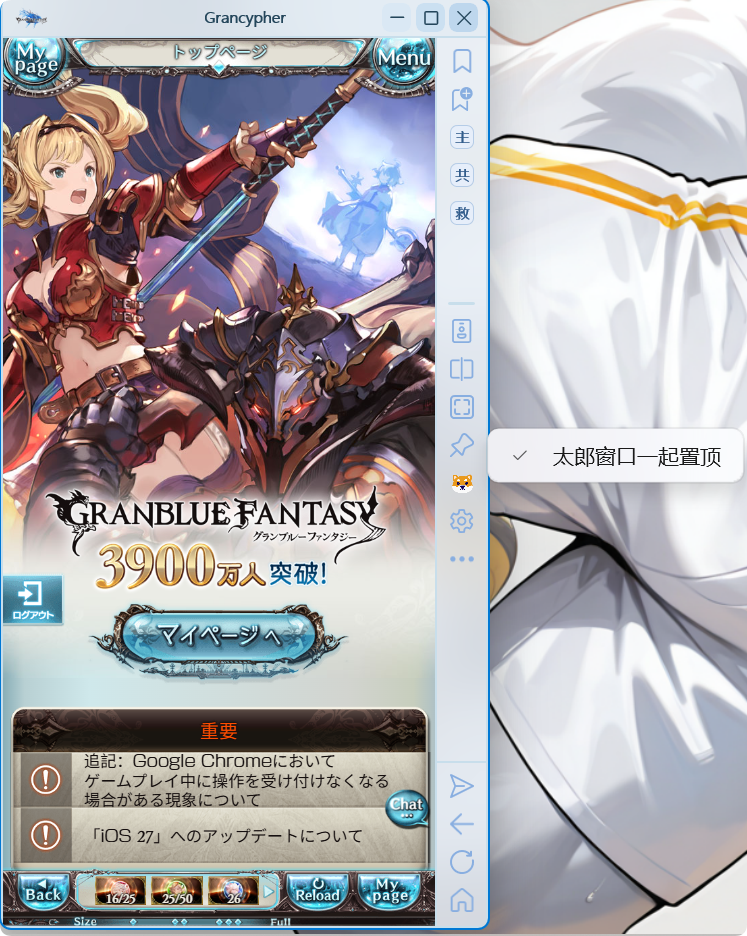

# 分屏与置顶

分屏用于在同一个窗口里查看两个页面，置顶用于让 Grancypher 保持在其他普通窗口上方。

## 开启双窗口

1. 点击工具区的“切换双窗口”按钮。
2. 点击左侧或右侧视图，选择当前操作目标。
3. 再使用返回、刷新、主页、书签或速达入口导航。
4. 拖动中间分隔线调整左右宽度。
5. 再次点击双窗口按钮，回到单视图。

分屏状态会记忆到当前配置。主、副视图分别保存网页缩放比例，画面适配也分别测量两个游戏视图。

**分屏共用当前配置的 Cookies，不是两个独立账户。** 想同时登录不同账户，请用[多用户配置](multi-user.md)打开独立实例。

## 主窗口置顶

点击工具区图钉按钮开启或关闭置顶。开启后，主窗口保持在普通窗口之上。窗口未激活时的材质效果属于另一项外观设置，不能代替置顶。

## 太郎跟随置顶

右键点击图钉，切换“太郎窗口一起置顶”。该选项默认开启；关闭后，主窗口置顶不再要求太郎一起置顶。

太郎窗口的打开、吸附和尺寸记忆见[太郎与用户脚本](tarou-js.md)。隐藏／恢复窗口的老板键见[快捷键与速达键](shortcuts.md)。
