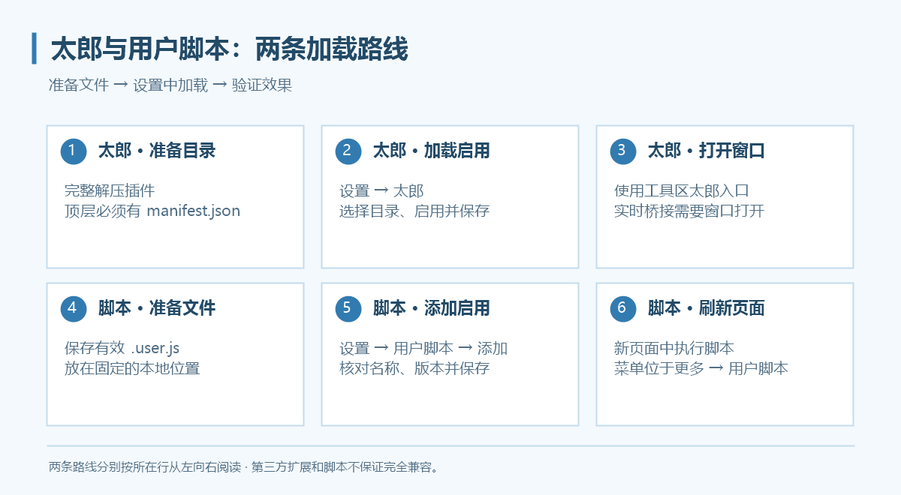
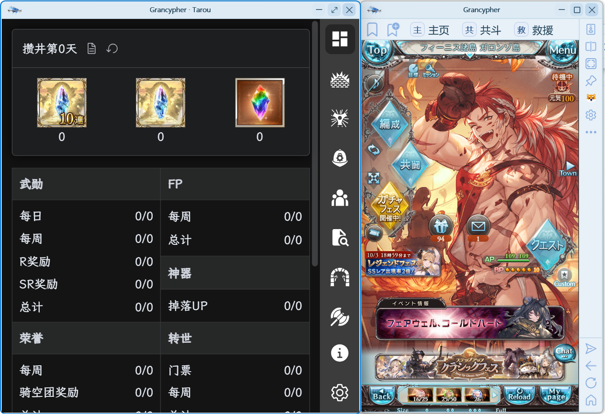

# 太郎与用户脚本

太郎以本地解压扩展的方式加载；用户脚本以本地 `.user.js` 文件的方式添加。二者有独立的设置入口。

## 加载太郎

1. 准备太郎的解压目录，确认**所选目录顶层包含 `manifest.json`**。
2. 打开 **设置 → 太郎**，通过添加入口选择目录，并启用插件。
3. 保存设置；若未加载，按提示或手动重启程序。
4. 使用工具区太郎按钮打开太郎窗口，或使用设置页提供的太郎窗口入口。

不要选择压缩包、插件目录的上一级目录或仅包含部分文件的目录。原插件目录请保留；移除加载项不会删除它。

## 窗口吸附与置顶

在“设置 → 太郎”选择窗口吸附方式。太郎记忆当前账户配置中上次关闭前的普通窗口大小，吸附时保持自己的高度。

“设置 → 外观 → 边缘空间不足时，附属面板自动换边”默认开启。关闭后保持选定侧的贴边关系与宽度，空间不足时可能有部分窗口超出屏幕。

需要跟随主窗口置顶时，右键主窗口图钉，勾选“太郎窗口一起置顶”。

## 实时数据与兼容范围

程序通过兼容桥接更新 Boss 血量、状态、特殊槽、贡献与战斗结束信息，**目前需要太郎窗口保持打开**。窗口关闭时不要期待桥接持续更新。

太郎原生“开启侧边栏”和“开启窗口栏”右键入口在 Grancypher 中隐藏，请使用工具区太郎入口。需要网页右键菜单时，在“设置 → 操作优化”启用。

WebView2 的扩展接口与 Chrome 有差异，不能保证所有太郎版本完全兼容。加载失败时先核对目录、重启，再按[诊断流程](../faq.md#diagnostics)收集日志。

## 添加用户脚本

1. 将脚本保存为本地 `.user.js` 文件，并放在不会随意移动的目录。
2. 打开 **设置 → 用户脚本 → ＋ 添加**，选择文件。
3. 确认列表显示名称、版本与文件地址，勾选启用。
4. 点击“应用”或“保存并关闭”。
5. 刷新目标网页或重新导航，使新脚本在新页面中生效。

脚本需包含有效的 `==UserScript==` 元信息块，单个脚本不能超过 **2 MB**。只添加你信任的脚本。

## 更新、停用与菜单

| 想做什么 | 操作 |
| --- | --- |
| 更新文件内容 | 修改本地文件后，在列表点击“重新读取本地文件”，保存并重新加载页面 |
| 暂时停用 | 取消启用，保存并重新加载页面 |
| 删除加载项 | 点击删除并确认，保存设置 |
| 使用脚本命令 | 打开工具区“更多 → 用户脚本”，选择脚本注册的菜单命令 |

重新读取会读取本地脚本及依赖；程序不提供脚本自动更新。列表保留文件地址，移动文件后需重新选择或添加。

## 油猴兼容说明

当前支持部分 `GM_*`／`GM.*` 功能，例如样式、值存储、资源读取、打开标签和菜单命令，也处理 `@match`、`@include`、`@exclude` 等元信息。**完整 Tampermonkey API 尚未实现**，例如依赖 `GM_xmlhttpRequest` 的脚本不能据此认为可直接使用。

外部依赖只支持符合限制的 HTTPS 地址或脚本文件夹内相对文件；不支持任意本机绝对路径依赖。依赖总数最多 24 项、每项最多 2 MB、合计最多 12 MB。报错时检查依赖地址、文件位置和脚本所需 API。

如果有脚本无法正常运作的情况，请将脚本源文件与问题一同提交，作者会评估适配必要性。
