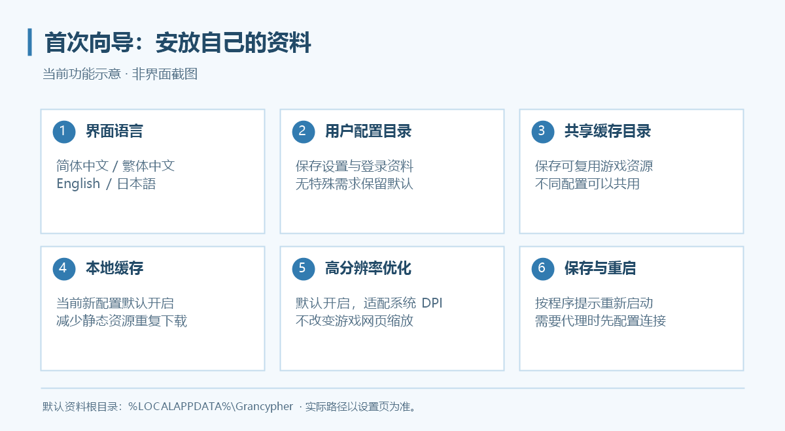
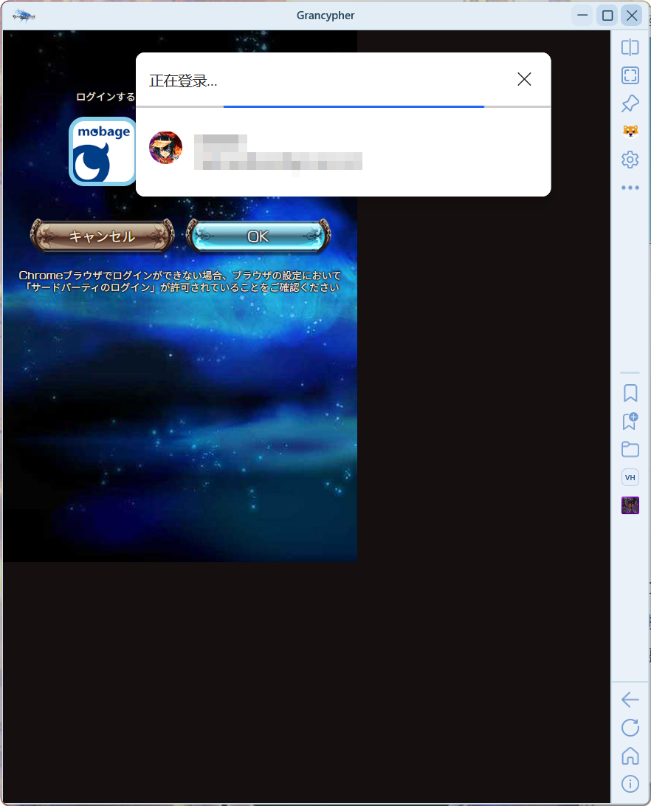
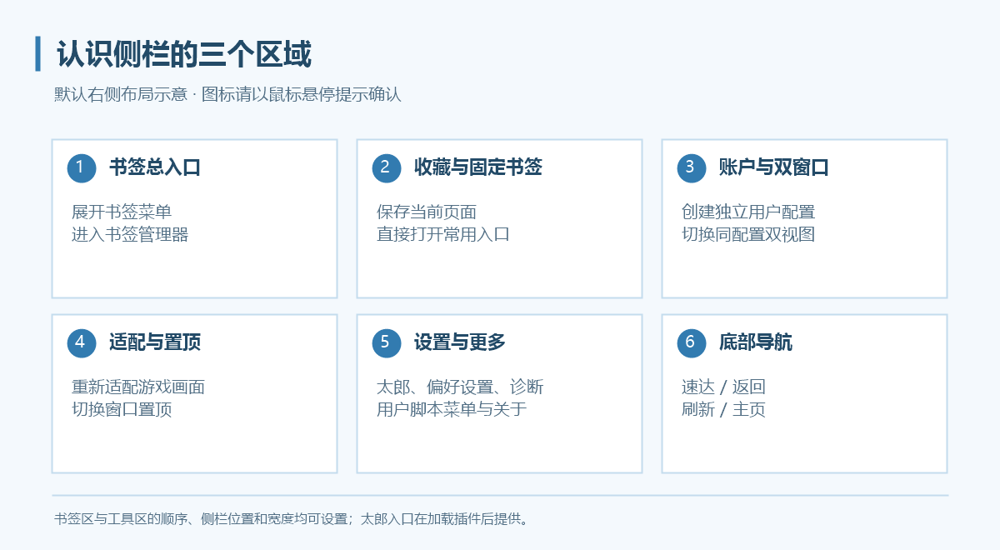

# 第一次使用

第一次启动会显示向导。先确定数据位置，再配置连接，最后登录游戏。

*上图为当前功能示意图。程序内的目录以你实际选择的位置为准。*

## 1. 完成首次向导

| 项目 | 如何选择 |
| --- | --- |
| 界面语言 | 在向导右上角选择简体中文、繁体中文、英语或日语 |
| Cookies 与账号资料／用户配置目录 | 无特殊需求保留默认位置；不同游戏账户使用不同配置目录 |
| 共享缓存目录 | 默认位置即可；多个配置可以指向同一缓存目录 |
| 本地缓存 | 当前新配置默认开启，减少游戏静态资源重复下载 |
| 高分辨率优化 | 默认开启，按系统缩放比例适配设置、向导等独立窗口 |

保存向导设置，并按程序提示完成重启。以后可以从“设置 → 数据与缓存 → 重新打开初次向导”再次查看。

默认资料位于 `%LOCALAPPDATA%\Grancypher`。配置与 Cookies 放在 `Profiles\配置标识` 下，缓存默认放在 `Cache`；实际位置以设置页显示为准。

## 2. 如需代理，先配置连接

打开侧栏的齿轮按钮，进入“设置 → 连接”。选择适合自己网络环境的代理模式，保存并重启。具体填写方式见[代理设置](proxy.md)。

**修改代理后只关闭设置窗口不会让新代理生效，必须重启程序。**

## 3. 登录游戏

点击导航区的主页按钮，进入游戏页面，选择你实际使用的登录平台。登录、授权和确认步骤都需要在页面中完成。

### Mobage

登录确认页面出现时，程序会尝试拓宽窗口以显示确认内容。按页面提示完成确认后再继续；不要在登录跳转过程中反复调整 Size 或刷新。

如果反复回到登录页，先核对代理与重启状态，再查看[登录排查](faq.md#login)。

### DMM

按 DMM 页面的登录与授权流程操作。首次创建游戏账户时，若网页打开额外游戏弹窗，可在完成确认后关闭弹窗，回到 Grancypher 点击主页按钮。

### Yahoo!

I don't know her.

## 4. 认识侧栏

*示意图展示默认右侧侧栏；书签栏模式与区域顺序可以修改。按钮图标可通过鼠标悬停提示确认。*

| 区域 | 常用操作 |
| --- | --- |
| 书签区 | 打开书签菜单、收藏当前页面、打开已固定书签 |
| 工具区 | 账户管理、切换双窗口、重新适配、置顶、太郎、设置与更多功能 |
| 导航区 | 速达、返回、刷新、主页 |

太郎入口在插件加载后提供。“更多”菜单可打开开发者工具、关于、用户脚本菜单和 Debug 模式。

## 5. 做一次日常操作检查

1. 打开一个常用页面，点击“收藏当前页面”并保存。
2. 通过书签入口重新打开该页面。
3. 在目标页面右键点击速达按钮，保存当前网址，再左键尝试打开。
4. 点击“重新适配游戏画面”，确认窗口适合当前画面。

设置第二个独立游戏账户时继续阅读[多用户配置](features/multi-user.md)。
