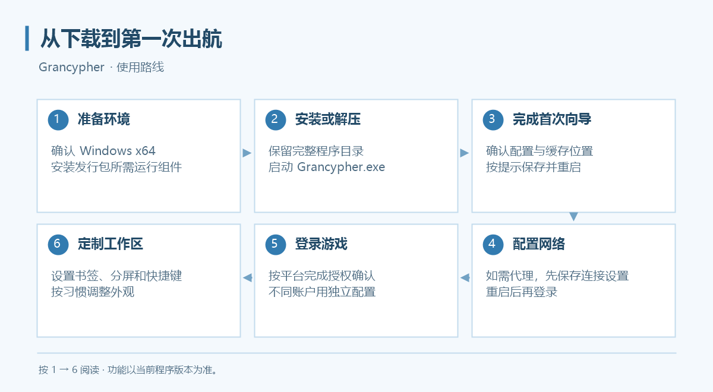

# Grancypher 使用手册

现代化《碧蓝幻想》专用浏览器

与你一起，直达空之彼端。

<a class="sky-button" href="https://fluffygrimoire.site/">获取应用</a>
<a class="sky-button" href="getting-started/">开始上手</a>

Grancypher 是面向《碧蓝幻想》网页版的 Windows 桌面浏览器，使用原生 WinUI 3 界面和 Microsoft Edge WebView2 引擎。本手册内容按最新版本撰写；使用较早版本时，部分选项可能尚未提供。

## 从这里开始

1. [安装与环境配置](install.md)：选安装版或便携版，准备运行组件。
2. [第一次使用](getting-started.md)：确认配置目录、缓存目录并完成登录。
3. [代理设置](proxy.md)：需要代理时，先保存连接设置并重启。
4. 根据使用习惯设置书签、分屏、快捷键和外观。

## 功能导航

| 你想做什么 | 对应说明 |
| --- | :---: |
| 保存常用页面、整理文件夹、调整书签栏 | [书签管理](features/bookmarks.md) |
| 同时查看两个页面，让窗口保持在上层 | [分屏与置顶](features/split-pin.md) |
| 去除多余区域、调整游戏画面大小 | [自适应画面裁剪](features/resize.md) |
| 打开太郎窗口、添加本地用户脚本 | [太郎与用户脚本](features/tarou-js.md) |
| 用键盘或鼠标跳转，设置速达入口 | [快捷键与速达键](features/shortcuts.md) |
| 分别保存不同账户的登录与设置 | [多用户配置](features/multi-user.md) |
| 减少重复下载，检查与清理资源缓存 | [本地缓存](features/local-cache.md) |
| 调整主题、透明度、备份和诊断 | [设置](features/settings.md) |
| 调整侧栏区域、图标显示与顺序 | [侧栏与图标管理](features/sidebar.md) |
| 加载 Chrome 插件、设置网站权限 | [Chrome 插件支持](features/chrome-extensions.md) |
| 切换浏览器身份、排查图形后端 | [实验性设置](features/experimental.md) |
| 检查和安装新版、跳过指定版本 | [程序更新](updates.md) |
| 检查运行组件和网络、生成报告 | [运行环境诊断](diagnostics.md) |

## 先了解三个概念

- **用户配置**保存程序设置、书签，以及该配置使用的 WebView2 登录资料。不同游戏账户应使用不同配置。
- **分屏**是同一配置里的两个浏览器视图，共用登录资料；需要独立登录时使用多用户配置。
- **共享缓存**保存可复用的游戏资源。不同配置可以共用缓存目录，但不要共用 Cookies 目录。

Grancypher 为非官方应用，与 Cygames 无隶属关系。用户脚本和扩展的兼容性取决于具体版本，内置用户脚本加载器不提供完整 Tampermonkey 环境；现在支持程序内检查、下载并确认安装更新，也可通过实验性功能加载 Chrome 插件。

## 下载与反馈

- [发行包与版本记录](https://github.com/rawlkian/grancypher-release/releases)
- [常见问题](faq.md)
- [提交问题](https://github.com/rawlkian/grancypher-release/issues/new)
- [更新日志](changelog.md)

## 声明
本站点内所有用户脚本仅作学习与分享交流用途，且本程序提供的用户脚本功能仅为提供使用接口，一切因使用用户脚本产生的风险与后果（账号被 Ban）请自行承担！