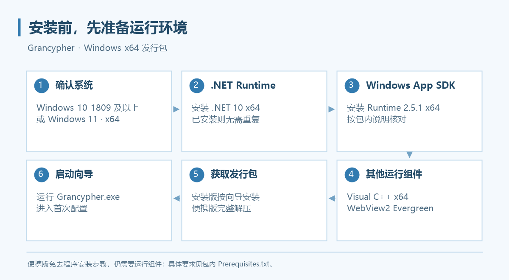

# 安装与环境配置

先准备运行组件，再安装或解压 Grancypher。便携版仅免去程序安装步骤，仍需要运行组件。



## 系统要求

发行包面向 **Windows x64**，支持 Windows 10 1809 及以上版本、Windows 11。请在系统“设置 → 系统 → 关于”确认系统类型。正式发行包以下载页提供的架构为准。

## 准备运行组件

当前发行包不捆绑以下组件，已安装的组件无需重复安装。包内 `Prerequisites.txt` 是核对安装要求的直接依据。

| 组件 | 当前发行要求 | 官方下载入口 |
| --- | --- | --- |
| .NET Runtime | .NET 10，x64 | [下载 .NET 10](https://dotnet.microsoft.com/download/dotnet/10.0) |
| Windows App SDK Runtime | 2.5.1，x64 | [Windows App SDK 下载页](https://learn.microsoft.com/windows/apps/windows-app-sdk/downloads) |
| Visual C++ Redistributable | x64 | [下载运行库](https://aka.ms/vc14/vc_redist.x64.exe) |
| Microsoft Edge WebView2 Runtime | Evergreen | [WebView2 下载页](https://developer.microsoft.com/microsoft-edge/webview2/) |

使用程序不需要安装 Visual Studio 或开发用 SDK。运行组件若提示重启 Windows，请先完成重启。

## 选择发行包

打开 [Releases](https://github.com/rawlkian/grancypher-release/releases)，展开目标版本的 **Assets**。

| 文件 | 用途 |
| --- | --- |
| `Grancypher-v版本号-Setup-win-x64.exe` | 安装版，按向导安装到当前用户 |
| `Grancypher-v版本号-Portable-win-x64.zip` | 便携版，解压后运行 |
| `SHA256SUMS-v版本号.txt` | 下载文件的 SHA-256 校验清单 |

### 安装版

1. 下载 `Setup-win-x64.exe`。
2. 按安装向导选择位置并完成安装。程序安装到当前用户，无需管理员权限；安装运行组件时按组件自身提示操作。
3. 从桌面或开始菜单入口启动 Grancypher。

### 便携版

1. 下载 `Portable-win-x64.zip`。
2. 将压缩包完整解压到可写目录，例如 `D:\Apps\Grancypher`。
3. 运行文件夹内的 `Grancypher.exe`。

**请保留整个解压目录，不要只复制 EXE，也不要直接在压缩包内运行。** 默认账户资料仍保存在 AppData，便携版不代表登录资料随 EXE 一起移动。

### 可选：核对下载文件

在 PowerShell 中计算下载文件的 SHA-256，并与同版本校验清单中的对应条目比较：

```powershell
Get-FileHash -LiteralPath "D:\Downloads\Grancypher-v0.3.4-Portable-win-x64.zip" -Algorithm SHA256
```

文件名和路径替换为自己的下载位置。

## 升级已有程序

### 备份现有数据
1. 在旧版“设置 → 数据与缓存”分别备份用户配置和书签。
2. 关闭全部 Grancypher 实例。
3. 安装新版，或把便携版完整解压到新的程序目录。
4. 启动后确认配置目录、书签和登录状态。

安装版与便携版可使用同一个已配置的数据目录。卸载程序不会删除已有登录资料和设置。程序目前没有自动更新功能。

从使用旧 `GranblueBrowser` 默认数据目录的版本升级时，新版不自动识别该旧目录；请通过选择已有配置目录或分别还原设置、书签处理。备份文件不包含 Cookies，详见[多用户配置](features/multi-user.md)。

安装完成后继续阅读[第一次使用](getting-started.md)。打不开程序时参见[常见问题](faq.md)。
