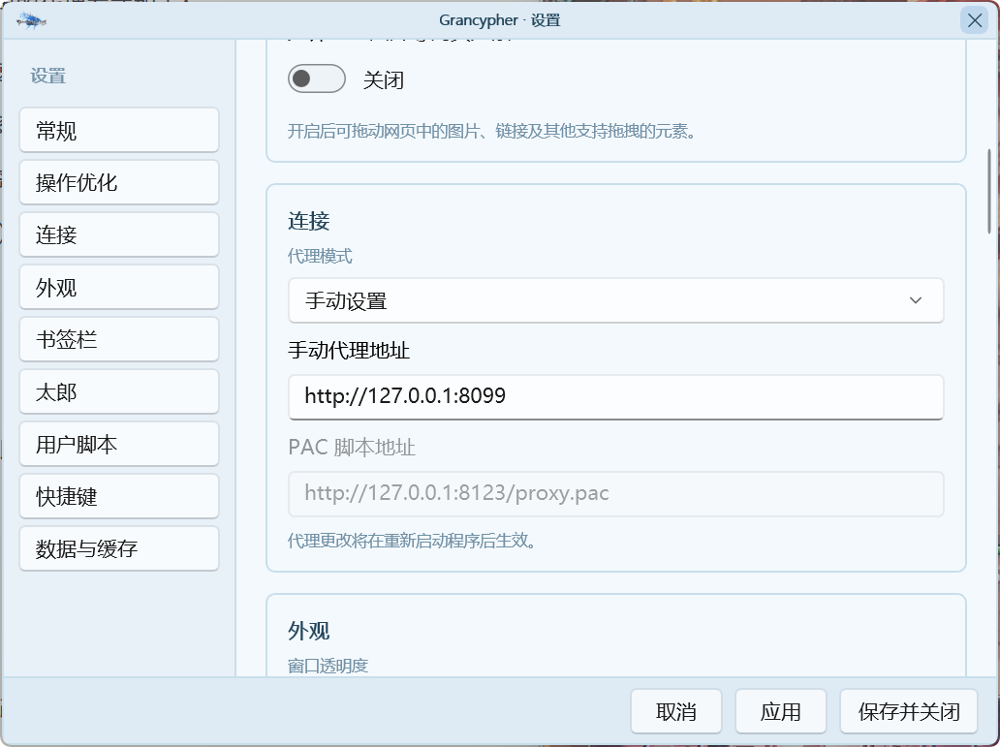
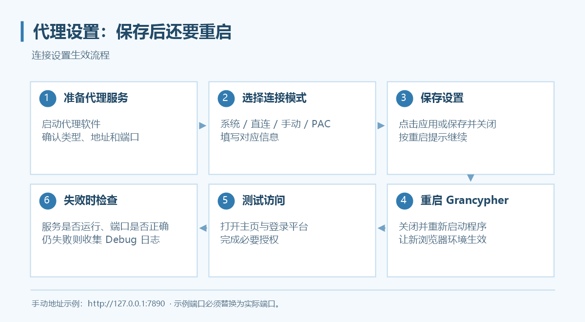

# 代理设置

入口：**侧栏齿轮 → 设置 → 连接**。程序支持系统代理、直连、手动设置和 PAC 四种模式。

*截图中的端口是示例，以你的代理软件实际监听端口为准。*

## 选择连接方式

| 模式 | 适用场景 | 需要填写 |
| --- | --- | --- |
| 使用系统代理 | Clash, V2Ray 等代理软件或已设置 Windows 代理| 通常无需填写地址 |
| 直连 | 直连或 UU 加速器等游戏加速器 | 无 |
| 手动设置 | Clash, V2Ray 等代理软件或岛风 Go | 手动代理地址 |
| PAC 自动代理脚本 | 以 ACGPower 为主 | 可访问的 PAC 脚本地址 |

## 手动代理
1. 先启动代理软件，确认 HTTP 或 SOCKS 监听地址与端口。
2. 在 Grancypher 选择“手动设置”。
3. 填入实际地址，例如 `http://127.0.0.1:7890`；使用 SOCKS 时按服务类型填写，例如 `socks5://127.0.0.1:1080`。
4. 点击“应用”或“保存并关闭”。
5. 按重启提示重新启动程序，再打开主页测试。

`127.0.0.1` 指本机。代理软件不在本机时应填它实际可访问的地址。不要把订阅链接填入代理地址，也不要凭截图推断端口。

## PAC 模式

选择“PAC 自动代理脚本”，填入完整地址，例如 `http://127.0.0.1:8123/proxy.pac`。地址必须返回 PAC 脚本，提供该脚本的服务需要保持运行。保存后重启程序。

## 生效与排查

如果仍然无法加载，请依次核对：代理软件是否运行、地址与端口是否匹配、是否已重启 Grancypher、登录平台域名是否也能访问。系统代理模式还应检查 Windows 系统代理是否真正启用。

Grancypher 的资源缓存无需安装证书，也不会替你启动代理服务。第三方加速器和代理工具的设置请按其自身说明操作，不能仅凭同时开启就判定兼容。

继续排查见[常见问题](faq.md)，缓存说明见[本地缓存](features/local-cache.md)。
