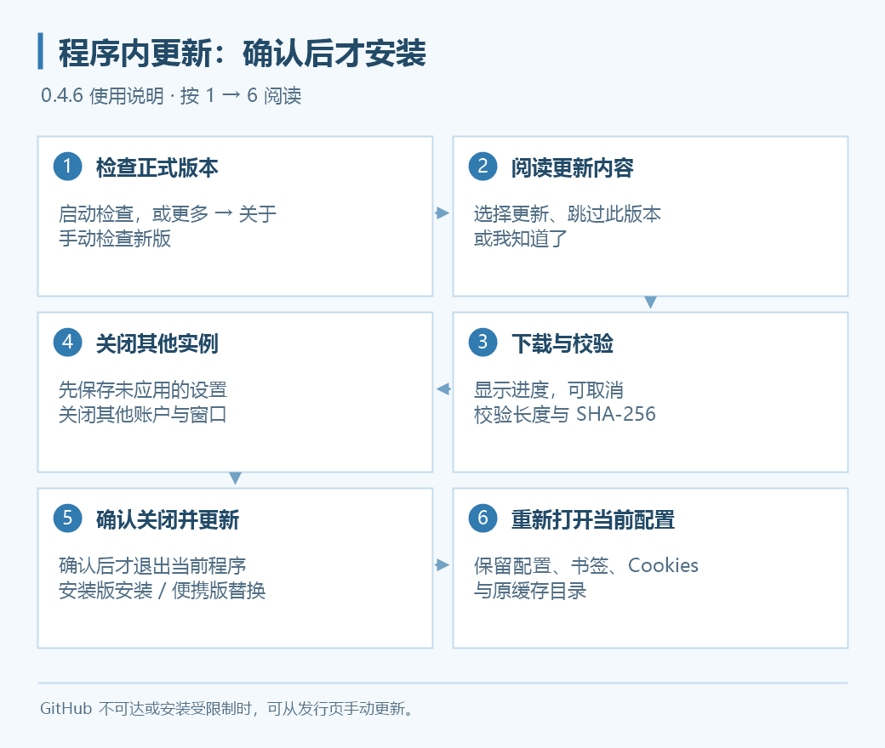

# 程序更新

Grancypher 从 0.3.7 起支持程序内更新。启动时检查新版，也可以从**工具区 → 更多 → 关于 Grancypher**手动检查；检查发现新版不会直接退出程序，安装前需要你确认。

*流程示意图，按钮名称以当前窗口为准。*

## 启动时的更新提醒

“关于”窗口中的“启动时检查更新”默认开启。0.4.2 起，发现新版会显示当前版本、新版和更新内容：

| 选择 | 结果 |
| --- | --- |
| 更新 | 开始下载与校验，安装前还会询问 |
| 跳过此版本 | 当前配置不再收到同一版本的启动提醒；有更新版本时仍提醒 |
| 我知道了 | 只关闭本次提醒，下次启动仍可提醒同一版本 |

跳过版本不关闭启动检查，也不影响“关于”窗口中的手动检查和更新。如果不希望启动检查，可在“关于”中关闭该选项。

## 手动检查与安装

1. 打开“更多 → 关于 Grancypher”，使用手动检查更新入口。
2. 阅读版本和更新内容，选择下载，等待进度完成。
3. 程序按安装方式与架构匹配发行包，并校验文件长度与 SHA-256。
4. **先关闭其他账户与窗口实例**，保存需要保留的未应用设置。
5. 确认“关闭并更新”。此时当前程序才退出，安装新版并重新打开当前配置。

下载及解压可取消，失败后可以重试。安装版保持已有安装目录；便携版替换前备份将覆盖的文件，失败时尝试回滚。更新不主动迁移或清理用户配置、Cookies、书签和缓存。

## 更新渠道和限制

目前使用 [GitHub Releases](https://github.com/rawlkian/grancypher-release/releases) 的正式版本通道，草稿、预发布与不符合数字版本格式的标签不参与自动安装。更新资源缺少校验信息或对应架构的发行包时，会提供发行页入口，不能自动安装。

运行 0.3.7 之前的程序需要先手动安装含更新功能的版本。当前新版仅发布安装包和便携包，不再额外上传校验清单；程序内更新校验不依赖单独的校验清单文件。

## 更新失败时

| 情况 | 处理 |
| --- | --- |
| GitHub 不可达 | 检查网络；环境自检可检查 GitHub 连通性，但不会验证整个下载流程 |
| 仍有其他实例运行 | 关闭对应实例后再确认安装 |
| 无法写入安装目录 | 核对目录权限，必要时使用发行页手动更新 |
| 系统策略禁止启动 PowerShell | 后台更新需要 Windows PowerShell，可改为手动安装 |
| 下载、校验或替换失败 | 保留错误提示，重试或手动更新，不要跳过校验强行安装 |

更新临时文件、便携版备份及失败日志保存在 `%TEMP%\Grancypher-Updates`。排查时保留相关文件，详情可结合[运行环境诊断](diagnostics.md)与[问题反馈](faq.md#diagnostics)。
